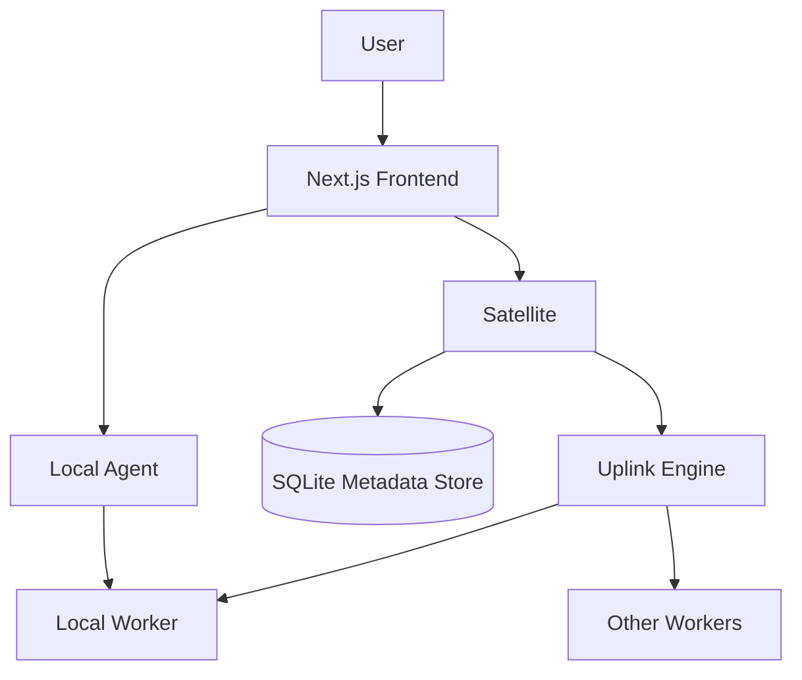
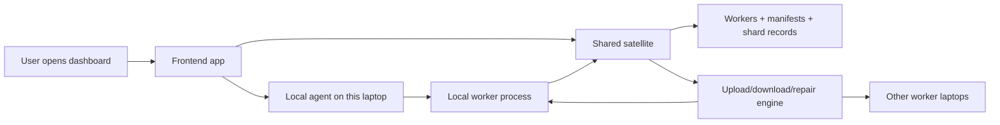
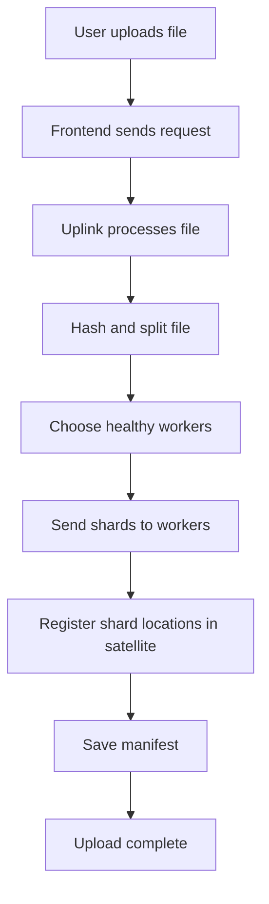
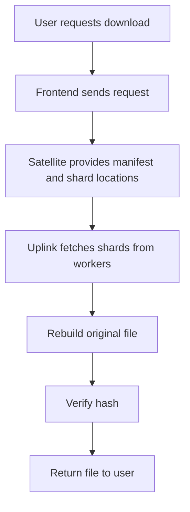
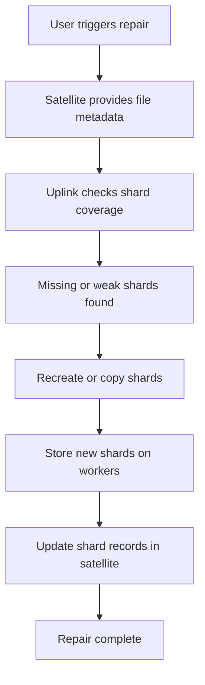

# DSprout Project Flow For Presentation

This file is a simple explanation of the DSprout project that you can use while presenting.

## 1. Project In One Line

DSprout is a distributed file storage system where multiple laptops share storage space on the same network, and one central service keeps track of which file shards are stored on which machine.

## 2. What Problem It Solves

Normally, one laptop stores one file in one place.

DSprout changes that model:

- a file is split into smaller parts
- those parts are distributed across multiple worker laptops
- the system keeps a record of where each part is stored
- if a shard is missing, the system can repair it

So the project is about:

- better storage sharing
- simple distributed coordination
- recovery and repair
- local-first contributor machines

## 3. Main Components

### `app/` - Frontend

This is the user dashboard built with Next.js.

It is used to:

- view workers
- register contributors
- control the local worker
- upload files
- download files
- inspect file health
- trigger repair

### `server/dsprout-satellite` - Central coordinator

This is the shared registry and metadata service.

It stores:

- worker details
- shard placement records
- file manifests

Think of it as the project's "control tower".

### `server/dsprout-agent` - Local machine controller

This runs on each laptop locally.

It is responsible for:

- starting the worker
- stopping the worker
- saving worker configuration
- showing local storage usage

Think of it as the "local manager" for one machine.

### `server/dsprout-worker` - Storage worker

This is the process that actually stores shards on disk and participates in the network.

It does these jobs:

- stores shard data locally
- registers itself with the satellite
- sends heartbeats
- responds to shard requests

### `server/dsprout-uplink` - File movement engine

This handles the real upload, download, and repair logic.

It talks to:

- the satellite to understand metadata
- the workers to send or fetch shard data

Think of it as the "transport engine" of the project.

### `server/dsprout-common` - Shared logic

This crate contains common building blocks used by the backend services:

- identity
- crypto
- hashing
- sharding
- manifest models
- network models

## 4. High-Level Architecture Flow



## 5. Full System Flow In Simple Words



## 6. How The Project Works Step By Step

### Step 1: System starts

- satellite starts on the main machine
- local agent starts on each contributor laptop
- worker starts through the local agent
- frontend connects to satellite and local agent

### Step 2: Worker joins the network

- worker creates or loads its identity
- worker advertises its reachable LAN address
- worker registers itself with the satellite
- worker keeps sending heartbeat updates

### Step 3: User uploads a file

- user selects a file in the frontend
- frontend sends upload request to the satellite flow
- uplink reads the file
- file is hashed, split into segments, and then into shards
- satellite helps identify healthy workers
- uplink sends shards to different workers
- satellite stores manifest and shard location metadata

### Step 4: User views file details

- frontend asks the satellite for manifest and shard location data
- frontend shows file metadata
- frontend shows where shards are placed
- frontend calculates health view from available metadata

### Step 5: User downloads a file

- user requests a file from the frontend
- uplink asks the satellite where shards are stored
- uplink fetches shards from workers
- file is reconstructed
- integrity is checked using hashes
- restored file is returned

### Step 6: User repairs a file

- frontend triggers repair
- uplink checks missing or weak shard placement
- uplink recreates or redistributes shards
- new shard records are written back to satellite

## 7. Upload Flow Chart



## 8. Download Flow Chart



## 9. Repair Flow Chart



## 10. Machine Roles

### Machine A

Usually acts as the main shared machine.

It runs:

- satellite
- optional local agent
- optional worker
- frontend

### Machine B / C / D

These are contributor machines.

Each one runs:

- local agent
- worker

Each contributor machine points to Machine A's satellite.

## 11. Important Idea To Explain While Presenting

There are two kinds of control in this project:

### Local control

Local control means operations only for the current laptop.

Example:

- `/agent` page
- start worker
- stop worker
- update local worker config
- view local storage usage

### Shared system control

Shared control means the whole distributed system view.

Example:

- `/workers`
- `/contributors`
- `/files`
- upload/download/repair actions
- shard placement and manifest records

This distinction is very important in the presentation.

## 12. Important Pages In The Frontend

- `/` : entry page
- `/workers` : all workers known to the satellite
- `/workers/[worker_id]` : details for one worker
- `/contributors` : contributor registration flow
- `/files` : file lookup
- `/files/upload` : upload a file
- `/files/download` : download a file
- `/agent` : local worker control panel

## 13. Startup Flow From Repo Root

The project includes a helper script:

```bash
./start_dsprout.sh
```

This script:

- detects the current LAN IP
- writes frontend env values
- starts the satellite
- starts the local agent
- updates worker advertise address
- starts the worker
- starts the frontend

So for presentation, you can say:

"One script can bring up the local DSprout stack and connect the current laptop into the shared storage network."

## 14. How Another Machine Reaches My Satellite

Another laptop can reach the satellite only through the LAN IP of the machine running `dsprout-satellite`.

It should not use:

- `127.0.0.1`
- `localhost`

because those values point to the same machine itself, not to the shared satellite machine.

### Real example from this machine

The current LAN IP of this machine is:

```text
10.35.148.207
```

So another laptop on the same Wi-Fi or LAN should use:

```text
SATELLITE_URL=http://10.35.148.207:7070
```

If it wants to test connectivity, it should try:

```text
http://10.35.148.207:7070/workers
```

If that endpoint opens or returns worker JSON, then the machine can reach the satellite successfully.

### Simple explanation for presentation

"The satellite is not reached through localhost from another laptop. Other machines must use the LAN IP of the satellite host machine. In this setup, that address is `10.35.148.207:7070`, so all contributor laptops point to that URL to join the shared DSprout network."

## 15. Real Backend State Stored By The System

The satellite keeps the important metadata in SQLite:

- worker records
- shard records
- signed manifests

This means:

- workers hold the actual shard data
- satellite holds the knowledge about where data lives

That is one of the clearest ways to explain the architecture.

## 16. Current Project Strengths

- clear separation between UI, coordination, local control, and storage worker
- supports multi-laptop LAN setup
- worker registration and heartbeat flow exists
- upload, download, and repair flows exist
- local worker management is available through UI
- metadata persistence exists through SQLite

## 17. Current Limitations

These are honest points you can mention if asked:

- upload and download currently use base64-heavy API flow, so large files are not optimized yet
- authentication is not added yet
- local agent is intentionally minimal
- health status is derived from metadata rather than a dedicated backend health service
- production packaging and cloud deployment are still future work

## 18. Very Simple 30-Second Explanation

"DSprout is a distributed storage project for multiple laptops on the same network. A central satellite service keeps track of workers, file manifests, and shard locations. Each laptop runs a local agent and a worker. The worker stores file shards and reports to the satellite. The frontend gives the user one place to control the local machine, see the shared network, upload files, download files, and repair missing shards."

## 19. Slightly Longer Presentation Script

"In DSprout, the frontend is the user-facing dashboard. The satellite is the central metadata service and acts like the control tower. Each laptop has a local agent, which manages the worker process on that machine. The worker is the actual storage node that stores shards and communicates with the distributed network. When a file is uploaded, the system breaks it into segments and shards, places those shards across workers, and saves the placement metadata in the satellite. When a file is downloaded or repaired, the uplink logic uses the satellite metadata to find shards and reconstruct or restore the file."

## 20. Best Way To Present The Project

Use this sequence:

1. start with the problem: one machine should not be the only place where a file lives
2. explain the five main parts: frontend, satellite, agent, worker, uplink
3. explain local control versus shared control
4. explain upload flow
5. explain download flow
6. explain repair flow
7. end with strengths and current limitations

## 21. One-Line Closing

DSprout is a practical distributed storage prototype that combines central metadata coordination with local worker storage and simple UI-based control.
